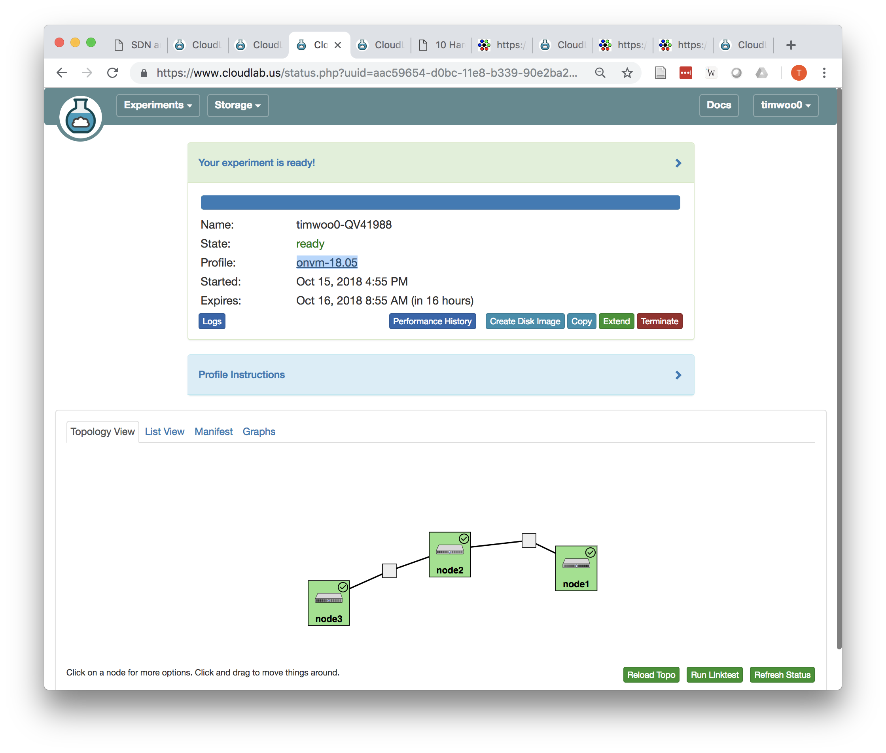

If you need access to real servers (not VMs), then you will need to use [NSF CloudLab](https://cloudlab.us).

**Read this page carefully!**

Create an account:
  - Go to the website and create an account, listing "GWCloudLab" as the project you want to join
  - Use your GW email address
  - You will need to create an SSH key. Be sure you understand what this means and keep it safe so that you are able to access the servers you create.
  - *I will need to approve your account before you can use it.* If you don't get a confirmation email within 48 hours, send me a reminder

CloudLab General Info:
  - CloudLab is free to use for academic and research purposes (thanks to the US Government!)
  - When you request a server from CloudLab, it will be assigned to you for 16 hours. After that time, you will lose everything on the server!
  - To prevent this from happening, you can request an extension for your servers (described below)
  - To avoid losing all of your work, you need to save your files somewhere else (e.g., GtiHub) or make disk snapshots
  - You must use these servers ONLY for purposes related to this class, and nothing else!

Once your account is approved, follow these steps to setup a cluster of 3 servers.
  - Log in
  - Be sure you have an SSH key setup for your account. Click your username in the top right and go to Manage SSH Keys
  - Follow this link to the [OpenNetVM profile](https://www.cloudlab.us/p/GWCloudLab/onvm-18.05) and click Next
    - This profile includes DPDK and OpenNetVM installed in the `/local/` directory. This saves you the trouble of installing them and their dependencies yourself.
  - On the Parameterize Tab:
    - This text box lets you specify how many servers you want to request. They will be deployed in a chain (first node connected to second, second to third, etc)
    - Enter 3 so that you can use `node1` as a client, `node2` as your middlebox, and `node3` as a server
    - Leave the Host Type as `c220g2` or change it to `c220g5`
    - Click Next
  - On the Finalize Tab:
    - Enter your name so the experiment can be distinguished from work by other students
    - Make sure the Project is "GWCloudLab"
    - Make sure the Cluster is "CloudLab Wisconsin"
    - Click Next
  - On the Schedule Tab
    - Click next to have it start right away, or change it for a delay
    - Note that by default your experiment will only last 16 hours!
  - Hit Finish to create your experiment.
    - The site should switch to a status page.  It may take 5-10 minutes for your nodes to start up. If you get an error, you can try to post to Piazza.

Eventually your experiment will be Ready like this:

Click on List View to see your servers:
  - The name of each server and the SSH command used to log into them will be displayed
  - You may be able to click on the link and have the SSH connection open. If not, copy/paste it into a terminal or your SSH client
  - To reach the server you will need to use your SSH key

To extend your experiment to last longer:
  - From the status page click the Arrow near the words "Your expeirment is ready!"
  - Click the Extend button
  - Drag the slider to extend by 7 days
  - You will need to provide a justification about why you are extending it. Write something about how you are using the resources for a class and you need more time.
  - In 7 days you will get a warning that it will expire soon. You may need to repeat this process then.
  - When you are done with your resources, click Terminate to destroy the experiment. Note that you will lose all data!
  - Try not to be wasteful with the servers -- if you aren't going to use them and you haven't made significant changes, then terminate the experiment and create a new one when you are ready to use it again.

### Using your servers
The profile provided to you creates a chain of servers (3 of them if you followed the directions). Your goal is to setup these servers so that `node1` will be a client, `node2` will be your middlebox, and `node3` will be a server.
  - When you first run the system, `node1` will not be able to reach `node3` (for example using ping)
  - If you are able to successfully run the DPDK `skeleton` or ONVM `bridge` middlebox examples on `node2`, then it will forward packets between them, allowing client and server to communicate successfully.
    - node 1 has IP: `192.168.1.1`
    - node 2 initially has IPs `192.168.1.2` and `192.168.1.3`, but when you bind it to DPDK it will lose control of those IP addresses.
    - node 3 has IP: `192.168.1.4`
